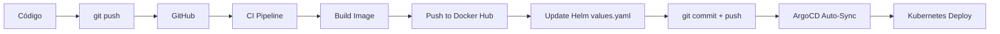

# Guía de ArgoCD - GitOps para Kubernetes

## 📘 ¿Qué es ArgoCD?

**ArgoCD** es una herramienta declarativa de GitOps para Kubernetes que:

- **Sincroniza automáticamente** el estado del cluster desde Git
- **Detecta y visualiza diferencias** (drift) entre Git y el cluster
- **Auto-corrige** cambios manuales (self-healing)
- **Gestiona múltiples aplicaciones** y entornos desde una UI centralizada
- **Proporciona rollback** a cualquier commit anterior

### 🎯 Principio GitOps

> **Git es la única fuente de verdad**  
> Todo cambio en Kubernetes se hace modificando Git, no el cluster directamente.

```
Desarrollador → Commit/Push → Git Repo → ArgoCD → Kubernetes Cluster
                                           ↓
                                    Auto-Sync/Heal
```

---

## 🏗️ Componentes de ArgoCD

### 1. **Application**
Define QUÉ desplegar:
- Repositorio Git (source)
- Path del Helm Chart o manifiestos
- Cluster y namespace destino
- Políticas de sincronización

### 2. **Project**
Agrupa aplicaciones con permisos comunes.

### 3. **Repository**
Credenciales para acceder a repos privados.

---

## 🚀 Instalación Realizada

### 1. Namespace y Componentes
```bash
kubectl create namespace argocd
kubectl apply -n argocd -f https://raw.githubusercontent.com/argoproj/argo-cd/stable/manifests/install.yaml
```

**Componentes desplegados:**
- `argocd-server`: UI y API REST
- `argocd-repo-server`: Interactúa con Git
- `argocd-application-controller`: Sincroniza aplicaciones
- `argocd-redis`: Cache
- `argocd-dex-server`: Autenticación SSO

### 2. Acceso a la UI
```bash
# Port-forward al servidor
kubectl port-forward svc/argocd-server -n argocd 8080:443

# Obtener contraseña inicial
kubectl -n argocd get secret argocd-initial-admin-secret -o jsonpath="{.data.password}" | base64 -d
```

**Credenciales:**
- Usuario: `admin`
- Password: `6G6Q8w9oGt3BYyCI`
- URL: https://localhost:8080 (acepta certificado auto-firmado)

---

## 📦 Application Creada

### Archivo: `argocd/biblioteca-app.yaml`

```yaml
apiVersion: argoproj.io/v1alpha1
kind: Application
metadata:
  name: biblioteca-cqrs
  namespace: argocd
spec:
  project: default
  
  # FUENTE: Repositorio Git + Helm Chart
  source:
    repoURL: https://github.com/LeoUnisabana/biblioteca-cqrs-deploy
    targetRevision: main
    path: helm/biblioteca-chart
    helm:
      valueFiles:
        - values-dev.yaml
  
  # DESTINO: Cluster local, namespace default
  destination:
    server: https://kubernetes.default.svc
    namespace: default
  
  # SINCRONIZACIÓN AUTOMÁTICA
  syncPolicy:
    automated:
      prune: true        # Elimina recursos no en Git
      selfHeal: true     # Revierte cambios manuales
```

**Características:**
- ✅ **Auto-Sync**: Detecta commits nuevos y despliega automáticamente
- ✅ **Self-Heal**: Si modificas manualmente el cluster, ArgoCD revierte
- ✅ **Prune**: Elimina recursos que ya no están en Git

---

## 🔐 Problema Actual: Repositorio Privado

### Error Encontrado
```
Failed to load target state: authentication required: Repository not found
```

**Causa:** ArgoCD no puede acceder al repositorio Git porque es **privado**.

### ✅ Solución 1: Hacer el Repositorio Público (Recomendado para Demo)

1. Ve a GitHub: https://github.com/LeoUnisabana/biblioteca-cqrs-deploy
2. Settings → General → Danger Zone
3. Click "Change visibility" → Make public
4. **Ventaja:** ArgoCD funcionará inmediatamente sin configuración adicional

### ✅ Solución 2: Configurar Credenciales en ArgoCD

#### Opción A: Personal Access Token (HTTPS)

**1. Genera un PAT en GitHub:**
- Ve a: https://github.com/settings/tokens
- Click "Generate new token (classic)"
- Scope: ✅ `repo` (full control)
- Copia el token generado

**2. Edita el archivo:** `argocd/repo-secret.yaml`
```yaml
stringData:
  username: TU_GITHUB_USERNAME
  password: ghp_xxxxxxxxxxxxxxxxxxxx  # Tu PAT
```

**3. Aplica el secret:**
```bash
kubectl apply -f argocd/repo-secret.yaml
```

**4. Fuerza refresh de la Application:**
```bash
kubectl delete application biblioteca-cqrs -n argocd
kubectl apply -f argocd/biblioteca-app.yaml
```

#### Opción B: SSH Key

**1. Genera un par de llaves SSH:**
```bash
ssh-keygen -t ed25519 -C "argocd@biblioteca" -f ~/.ssh/argocd_key
```

**2. Agrega la clave pública a GitHub:**
- Settings → SSH and GPG keys → New SSH key
- Pega el contenido de `~/.ssh/argocd_key.pub`

**3. Crea el secret con la clave privada:**
```bash
kubectl create secret generic argocd-repo-ssh \
  -n argocd \
  --from-file=sshPrivateKey=~/.ssh/argocd_key \
  --dry-run=client -o yaml | kubectl label -f - \
  argocd.argoproj.io/secret-type=repository --local --dry-run=client -o yaml | kubectl apply -f -
```

---

## 🎬 Demostración de GitOps

### 1. Verificar Estado Actual
```bash
# Ver applications
kubectl get applications -n argocd

# Estado detallado
kubectl describe application biblioteca-cqrs -n argocd
```

### 2. Modificar Configuración via Git
```bash
# Editar número de replicas
vim helm/biblioteca-chart/values-dev.yaml
# Cambiar: replicaCount: 1 → 2

# Commit y push
git add helm/biblioteca-chart/values-dev.yaml
git commit -m "Scale to 2 replicas"
git push
```

### 3. Observar Sincronización Automática
```bash
# ArgoCD detecta el cambio (< 3 minutos)
watch -n 5 'kubectl get pods -n default'

# Ver en la UI: https://localhost:8080
```

### 4. Prueba: Modificación Manual (Self-Heal)
```bash
# Escalar manualmente
kubectl scale deployment biblioteca-biblioteca-cqrs --replicas=3 -n default

# Esperar 5 segundos...
# ArgoCD revierte automáticamente a replicaCount=2 (valor en Git)
```

### 5. Rollback a Versión Anterior
```bash
# Opción 1: Via Git
git revert HEAD
git push

# Opción 2: Via UI de ArgoCD
# History → Select previous revision → Sync
```

---

## 📊 Comandos Útiles

### Gestionar Applications
```bash
# Listar applications
kubectl get applications -n argocd

# Ver estado completo
kubectl get application biblioteca-cqrs -n argocd -o yaml

# Forzar sincronización inmediata
kubectl patch application biblioteca-cqrs -n argocd \
  --type merge -p '{"operation":{"initiatedBy":{"username":"admin"},"sync":{"revision":"main"}}}'

# Eliminar application (cuidado: borra recursos)
kubectl delete application biblioteca-cqrs -n argocd
```

### Acceso a la UI
```bash
# Port-forward (en background)
kubectl port-forward svc/argocd-server -n argocd 8080:443 &

# Ver password de admin
kubectl -n argocd get secret argocd-initial-admin-secret \
  -o jsonpath="{.data.password}" | base64 -d; echo
```

### Troubleshooting
```bash
# Logs del repo-server (interacción con Git)
kubectl logs -n argocd deployment/argocd-repo-server --tail=50

# Logs del application-controller (sincronización)
kubectl logs -n argocd statefulset/argocd-application-controller --tail=50

# Ver eventos de la application
kubectl describe application biblioteca-cqrs -n argocd
```

---

## 🔄 Workflow Completo: CI/CD con ArgoCD



### Pasos:
1. **Developer:** Modifica código → `git push`
2. **CI (GitHub Actions):**
   - Build Docker image
   - Tag: `leounisabana/biblioteca-cqrs:1.0.3`
   - Push a Docker Hub
   - **Update:** `helm/biblioteca-chart/values-dev.yaml`
     ```yaml
     image:
       tag: "1.0.3"  # Actualizado automáticamente
     ```
   - Commit y push a Git
3. **ArgoCD:**
   - Detecta cambio en Git
   - Aplica nuevo Helm Chart
   - Pods se actualizan con nueva imagen

---

## 🎯 Ventajas de ArgoCD

### vs. `kubectl apply`
| Aspecto | kubectl | ArgoCD |
|---------|---------|--------|
| **Fuente de verdad** | Local, archivos sueltos | Git repository |
| **Sincronización** | Manual | Automática |
| **Drift detection** | No | Sí, visualizado en UI |
| **Rollback** | Manual, difícil | 1 click en UI |
| **Multi-cluster** | Difícil | Nativo |
| **Auditoría** | Logs de K8s | Git history + ArgoCD UI |

### vs. Helm directo
| Aspecto | Helm CLI | ArgoCD + Helm |
|---------|----------|---------------|
| **GitOps** | No | Sí |
| **Auto-sync** | No | Sí |
| **Self-healing** | No | Sí |
| **UI centralizada** | No | Sí |
| **Declarativo** | Imperativo | Declarativo |

---

## 📚 Conceptos Avanzados

### Sync Waves
Controla el orden de despliegue:
```yaml
metadata:
  annotations:
    argocd.argoproj.io/sync-wave: "1"  # Postgres primero
```

### Health Checks Personalizados
```yaml
spec:
  healthCheck:
    customHealthCheck: |
      hs = {}
      if obj.status.phase == "Running" then
        s.health.status = "Healthy"
      end
      return hs
```

### Sync Windows
Restringe deployments a horarios específicos:
```yaml
spec:
  syncWindows:
    - kind: allow
      schedule: '0 22 * * *'  # Solo a las 10pm
      duration: 1h
```

---

## 🔗 Referencias

- **Documentación Oficial:** https://argo-cd.readthedocs.io/
- **Best Practices:** https://argo-cd.readthedocs.io/en/stable/user-guide/best_practices/
- **Ejemplos:** https://github.com/argoproj/argocd-example-apps

---

## ✅ Checklist de Implementación

- [x] Instalar ArgoCD en cluster
- [x] Configurar acceso a UI
- [x] Crear Application para Helm Chart
- [ ] **Resolver autenticación a repositorio Git**
- [ ] Sincronizar aplicación desde Git
- [ ] Demostrar auto-sync con commit nuevo
- [ ] Demostrar self-healing
- [ ] Implementar CI/CD pipeline completo
