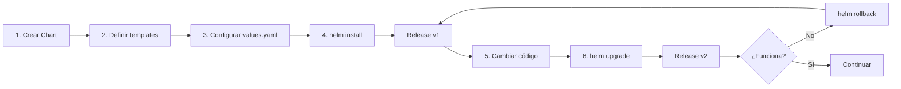

# ================================================================
# GUÍA COMPLETA DE HELM PARA BIBLIOTECA-CQRS
# ================================================================

## 📚 ¿Qué es Helm?

Helm es el **gestor de paquetes de Kubernetes**. Piensa en él como:
- **apt/yum** para Ubuntu/Red Hat
- **npm** para Node.js  
- **pip** para Python
- **NuGet** para .NET

### El Problema sin Helm

Con los manifests YAML normales (tu carpeta `k8s/`):

```
❌ Valores hardcodeados en múltiples archivos
❌ Difícil gestionar múltiples ambientes (dev, staging, prod)
❌ No hay versionado de releases  
❌ No hay rollback fácil
❌ Difícil reutilizar entre proyectos
❌ Gestión manual de dependencias
```

### La Solución con Helm

```
✅ Un solo archivo de configuración (values.yaml)  
✅ Plantillas reutilizables con variables
✅ Múltiples ambientes con diferentes values files
✅ Versionado automático de releases
✅ Rollback en 1 comando
✅ Empaquetado y distribución (.tgz)
✅ Gestión automática de dependencias
```

## 🎯 Conceptos Fundamentales

### 1. **Chart** = Paquete Completo

Un **Chart** es una colección de archivos que describe un conjunto de recursos de Kubernetes:

```
biblioteca-chart/              ← EL CHART
├── Chart.yaml                 ← Metadata del chart
├── values.yaml                ← Configuración por defecto
├── values-dev.yaml            ← Configuración dev
├── values-prod.yaml           ← Configuración prod
├── templates/                 ← Manifests con plantillas
│   ├── deployment.yaml
│   ├── service.yaml
│   ├── configmap.yaml
│   └── ...
└── .helmignore                ← Archivos a ignorar
```

###2. **Templates** = YAML con Variables

En lugar de valores fijos:

```yaml
# ❌ Sin Helm (hardcoded)
image: jmejia/biblioteca-cqrs:v1.0.2
replicas: 2
memory: 512Mi
```

Con Helm usas **plantillas Go Template**:

```yaml
# ✅ Con Helm (parametrizado)
image: {{ .Values.image.repository }}:{{ .Values.image.tag }}
replicas: {{ .Values.replicaCount }}
memory: {{ .Values.resources.requests.memory }}
```

### 3. **Values** = Configuración Centralizada

Defines TODO en UN archivo:

```yaml
# values.yaml
replicaCount: 2
image:
  repository: jmejia/biblioteca-cqrs
  tag: v1.0.2
resources:
  requests:
    memory: 512Mi
```

### 4. **Release** = Instancia Desplegada

Un **Release** es una instancia instalada de un chart:

```bash
helm install biblioteca-dev ./biblioteca-chart -f values-dev.yaml   # Release 1
helm install biblioteca-prod ./biblioteca-chart -f values-prod.yaml # Release 2
```

- **Mismo chart**
- **Diferentes configuraciones**  
- **Dos releases independientes**

### 5. **Revision** = Versión del Release  

Cada `helm upgrade` crea una nueva revisión:

```
biblioteca-dev:
  Revision 1: imagen v1.0.0 (initial install)
  Revision 2: imagen v1.0.1 (upgrade)
  Revision 3: imagen v1.0.2 (upgrade) ← ACTUAL
  
# Rollback a revisión 2:
helm rollback biblioteca-dev 2
```

## 🚀 Flujo de Trabajo

### Workflow Típico con Helm



### Comparación: Sin Helm vs Con Helm

| Acción | Sin Helm | Con Helm |
|--------|----------|----------|
| **Desplegar** | `kubectl apply -f k8s/` (8 archivos) | `helm install biblioteca ./chart` |
| **Cambiar imagen** | Editar deployment.yaml + apply | `helm upgrade biblioteca ./chart --set image.tag=v1.0.3` |
| **Múltiples ambientes** | Mantener 3 carpetas k8s-dev/, k8s-prod/ | 1 chart + values-dev.yaml, values-prod.yaml |
| **Rollback** | `kubectl apply` de backup manual | `helm rollback biblioteca 2` |
| **Ver historial** | Git log (si commiteas) | `helm history biblioteca` |
| **Ver config actual** | `kubectl get` de cada recurso | `helm get values biblioteca` |
| **Actualizar 1 valor** | Editar YAML + apply | `helm upgrade --set key=value` |
| **Eliminar todo** | `kubectl delete` de cada archivo | `helm uninstall biblioteca` |

## 📦 Anatomía del Chart de Biblioteca-CQRS

### Chart.yaml - Metadata

```yaml
apiVersion: v2
name: biblioteca-cqrs
version: 1.0.0              # Versión del CHART
appVersion: "1.0.2"         # Versión de la APLICACIÓN
description: Helm Chart para Biblioteca CQRS
maintainers:
  - name: LeoUnisabana
    email: leonardo.mejia@unisabana.edu.co
```

### values.yaml - Configuración Central

```yaml
replicaCount: 2

image:
  repository: jmejia/biblioteca-cqrs
  tag: v1.0.2

service:
  type: ClusterIP
  port: 8089

resources:
  requests:
    cpu: 250m
    memory: 650Mi

postgresql:
  enabled: true
  auth:
    database: biblioteca_db
    username: biblioteca_user

newrelic:
  enabled: true
  appName: biblioteca-cqrs
```

### templates/deployment.yaml - Template con Variables

```yaml
apiVersion: apps/v1
kind: Deployment
metadata:
  name: {{ include "biblioteca-cqrs.fullname" . }}  # Función helper
  labels:
    {{- include "biblioteca-cqrs.labels" . | nindent 4 }}  # Include helper
spec:
  {{- if not .Values.autoscaling.enabled }}
  replicas: {{ .Values.replicaCount }}  # Variable de values.yaml
  {{- end }}
  template:
    spec:
      containers:
      - name: {{ .Chart.Name }}
        image: "{{ .Values.image.repository }}:{{ .Values.image.tag }}"
        resources:
          {{- toYaml .Values.resources | nindent 12 }}  # YAML anidado
```

### templates/_helpers.tpl - Funciones Reutilizables

```yaml
{{/*
Nombre completo de la aplicación
*/}}
{{- define "biblioteca-cqrs.fullname" -}}
{{- printf "%s-%s" .Release.Name .Chart.Name | trunc 63 }}
{{- end }}

{{/*
Labels comunes
*/}}
{{- define "biblioteca-cqrs.labels" -}}
app.kubernetes.io/name: {{ include "biblioteca-cqrs.name" . }}
app.kubernetes.io/instance: {{ .Release.Name }}
helm.sh/chart: {{ .Chart.Name }}-{{ .Chart.Version }}
{{- end }}
```

## 🎨 Ventajas Clave

### 1. Reutilización y DRY

```yaml
# ❌ Sin Helm: repetir en 8 archivos
# configmap.yaml
name: biblioteca-cqrs-config

# deployment.yaml
name: biblioteca-cqrs

# service.yaml
name: biblioteca-cqrs-service

# ✅ Con Helm: define una vez
{{- define "biblioteca-cqrs.name" -}}
biblioteca-cqrs
{{- end }}
```

### 2. Configuración como Código

```bash
# Git history de configuraciones
git log values-prod.yaml

# Auditoría completa:
helm history biblioteca-prod
REVISION  UPDATED                  STATUS      CHART               DESCRIPTION
1         Tue Mar 1 10:00:00 2026  superseded  biblioteca-cqrs-1.0.0  Install complete
2         Tue Mar 2 14:30:00 2026  superseded  biblioteca-cqrs-1.0.0  Upgrade to v1.0.1
3         Wed Mar 3 09:15:00 2026  deployed    biblioteca-cqrs-1.0.0  Upgrade to v1.0.2
```

### 3. Testing sin Desplegar

```bash
# Renderizar templates (dry-run local)
helm template biblioteca ./biblioteca-chart

# Ver qué va a cambiar (dry-run en cluster)
helm upgrade biblioteca ./biblioteca-chart --dry-run --debug

# Validar sintaxis
helm lint ./biblioteca-chart
```

### 4. Gestión de Secretos Mejorada

```yaml
# values.yaml (commitable)
postgresql:
  auth:
    username: biblioteca_user

# secrets-prod.yaml (NO commitear, en .gitignore)
postgresql:
  auth:
    password: "contraseña-segura-producción"

# Comando:
helm install biblioteca ./chart -f values.yaml -f secrets-prod.yaml
```

### 5. Dependencias Declarativas

```yaml
# Chart.yaml
dependencies:
  - name: postgresql
    version: "15.2.0"
    repository: "https://charts.bitnami.com/bitnami"
    condition: postgresql.enabled

# Helm descarga e instala PostgreSQL automáticamente
helm dependency update
helm install biblioteca ./chart
```

## 🔧 Comandos Esenciales

### Instalar

```bash
# Instalación básica
helm install biblioteca ./biblioteca-chart

# Con namespace
helm install biblioteca ./biblioteca-chart --namespace dev --create-namespace

# Con values custom
helm install biblioteca ./biblioteca-chart -f values-dev.yaml

# Sobreescribir valores específicos
helm install biblioteca ./biblioteca-chart \
  --set image.tag=v1.0.3 \
  --set replicaCount=5

# Dry-run (no instala, solo muestra qué haría)
helm install biblioteca ./biblioteca-chart --dry-run --debug
```

### Actualizar (Upgrade)

```bash
# Actualizar con nuevos valores
helm upgrade biblioteca ./biblioteca-chart -f values-prod.yaml

# Cambiar solo un valor
helm upgrade biblioteca ./biblioteca-chart --set image.tag=v1.0.4

# Upgrade con espera hasta que esté listo
helm upgrade biblioteca ./biblioteca-chart --wait --timeout 5m

# Ver qué va a cambiar (dry-run)
helm upgrade biblioteca ./biblioteca-chart --dry-run --debug
```

### Ver Estado

```bash
# Listar releases
helm list
helm list --all-namespaces

# Estado de un release
helm status biblioteca

# Ver valores aplicados
helm get values biblioteca
helm get values biblioteca --all  # Incluye defaults

# Ver manifests desplegados
helm get manifest biblioteca

# Ver historial de revisiones
helm history biblioteca
```

### Rollback

```bash
# Rollback a revisión anterior
helm rollback biblioteca

# Rollback a revisión específica
helm rollback biblioteca 2

# Rollback con espera
helm rollback biblioteca 2 --wait --timeout 5m
```

### Desinstalar

```bash
# Desinstalar release
helm uninstall biblioteca

# Des instalar manteniendo historial (para posible rollback)
helm uninstall biblioteca --keep-history
```

### Debugging

```bash
# Renderizar templates localmente
helm template biblioteca ./biblioteca-chart

# Validar sintaxis
helm lint ./biblioteca-chart

# Ver qué va a pasar sin ejecutar
helm install biblioteca ./biblioteca-chart --dry-run --debug

# Ver todos los recursos creados
kubectl get all -l "app.kubernetes.io/instance=biblioteca"
```

## 🌍 Ambientes Múltiples

### Estructura de Valores

```
helm/biblioteca-chart/
├── values.yaml           # Base (defaults)
├── values-dev.yaml       # Desarrollo
├── values-staging.yaml   # Staging
└── values-prod.yaml      # Producción
```

### Desarrollo

```bash
helm install biblioteca-dev ./biblioteca-chart \
  -f values-dev.yaml \
  --namespace dev \
  --create-namespace
```

**Características dev:**
- 1 réplica
- Recursos mínimos (100m CPU, 512Mi memory)
- HPA deshabilitado
- Logging en DEBUG
- Pull policy: Always

### Staging

```bash
helm install biblioteca-staging ./biblioteca-chart \
  -f values-staging.yaml \
  --namespace staging \
  --create-namespace
```

**Características staging:**
- 2 réplicas
- Recursos medios
- HPA habilitado (2-5 pods)
- Similar a producción pero escalado

### Producción

```bash
helm install biblioteca-prod ./biblioteca-chart \
  -f values-prod.yaml \
  --namespace prod \
  --create-namespace
```

**Características prod:**
- 3-5 réplicas
- Recursos altos (500m-2000m CPU, 1-2Gi memory)
- HPA agresivo (3-20 pods)
- Service tipo LoadBalancer
- Anti-affinity (pods en diferentes nodos)
- Logging en WARN/INFO

## 💡 Casos de Uso Prácticos

### Caso 1: Deploy de Nueva Versión

```bash
# 1. Cambiar versión de imagen en values
vim values-prod.yaml  # Cambiar image.tag: v1.0.3

# 2. Upgrade
helm upgrade biblioteca-prod ./biblioteca-chart -f values-prod.yaml

# 3. Ver progreso
kubectl rollout status deployment/biblioteca-prod

# 4. Si falla, rollback
helm rollback biblioteca-prod
```

### Caso 2: Escalar Horizontalmente

```bash
# Opción 1: Cambiar values file
helm upgrade biblioteca-prod ./biblioteca-chart \
  --set replicaCount=10

# Opción 2: Ajustar HPA
helm upgrade biblioteca-prod ./biblioteca-chart \
  --set autoscaling.maxReplicas=20 \
  --set autoscaling.targetCPUUtilizationPercentage=60
```

### Caso 3: Cambiar Configuración de New Relic

```bash
# Cambiar labels de New Relic
helm upgrade biblioteca-prod ./biblioteca-chart \
  --set newrelic.labels="Environment:production;Critical:true;Team:backend"
```

### Caso 4: Migrar de Dev a Prod

```bash
# 1. Probar en dev
helm install biblioteca-dev ./biblioteca-chart -f values-dev.yaml -n dev

# 2. Cuando esté estable, desplegar en prod (mismo chart, diferentes valores)
helm install biblioteca-prod ./biblioteca-chart -f values-prod.yaml -n prod

# Mismo código, diferentes configuraciones
```

### Caso 5: Disaster Recovery

```bash
# Ver historial
helm history biblioteca-prod
REVISION  STATUS      CHART                 DESCRIPTION
1         superseded  biblioteca-cqrs-1.0.0 Install
2         superseded  biblioteca-cqrs-1.0.0 Upgrade to v1.0.1
3         failed      biblioteca-cqrs-1.0.0 Upgrade to v1.0.2 (FAILED)

# Rollback a última versión funcional
helm rollback biblioteca-prod 2

# Verificar
helm status biblioteca-prod
```

## 🔒 Seguridad y Mejores Prácticas

### 1. NO Commitear Secretos

```bash
# .gitignore
secrets-*.yaml
*-secrets.yaml
```

Usar archivos separados:

```bash
helm install biblioteca ./chart \
  -f values-prod.yaml \
  -f secrets-prod.yaml  # No está en Git
```

### 2. Usar Herramientas de Secretos

```bash
# Sealed Secrets
kubeseal < secrets.yaml > sealed-secrets.yaml  # Commitable

# External Secrets Operator
# Define secrets en Vault, AWS Secrets Manager, etc.
```

### 3. Validación Pre-Deploy

## ```bash
# 1. Lint
helm lint ./biblioteca-chart

# 2. Dry-run
helm install biblioteca ./biblioteca-chart --dry-run

# 3. Template render
helm template biblioteca ./biblioteca-chart | kubectl apply --dry-run=client -f -
```

### 4. Versionado Semántico

```yaml
# Chart.yaml
version: 1.2.3   # MAJOR.MINOR.PATCH

# MAJOR: Cambios incompatibles (breaking changes)
# MINOR: Nuevas funcionalidades compatibles
# PATCH: Bug fixes
```

## 🎓 Recursos Adicionales

- **Documentación Oficial:** https://helm.sh/docs/
- **Chart Best Practices:** https://helm.sh/docs/chart_best_practices/
- **Artifact Hub:** https://artifacthub.io/ (repositorio de charts públicos)
- **Repo Local:** https://github.com/LeoUnisabana/biblioteca-cqrs-deploy

---

**Creado por:** Leonardo Mejía  
**Proyecto:** Biblioteca CQRS - Maestría en Arquitectura de Software  
**Universidad:** Universidad de La Sabana  
**Fecha:** Marzo 2026
